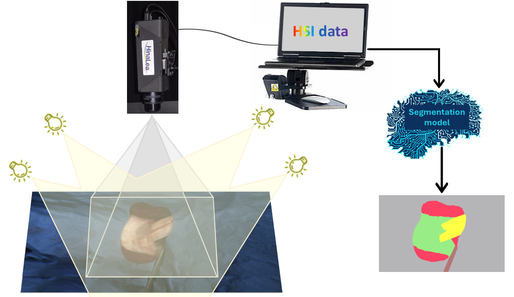

<div align="center">
  
</div>

# Hyperspectral Orthopedic Tissue Segmentation

**HIST-Seg** is the first open-access medical hyperspectral imaging (HSI) dataset dedicated to orthopedic-relevant tissues segmentation. The dataset contains 220 hyperspectral acquisitions from ten bovine specimens, acquired with the HinaLea camera system. Images are semantically annotated with seven classes: bone, cartilage, ligament, fat, flesh, surgical instruments and operative-field background.

This repository provides a complete pipeline for working with hyperspectral orthopedic surgical data, including:
- Reading and preprocessing hyperspectral datacubes (HSI) and corresponding masks
- Generating training/validation/test datasets
- Training deep learning models (2D U-Net with different encoder backbones: MobileNet_v2, ResNet-18, etc.)
- Testing trained models on new hyperspectral datacubes
- Visualizing segmentation maps


## Dataset Overview
The dataset was generated using a controlled acquisition pipeline specifically designed to simulate realistic orthopedic surgical conditions. It includes a wide range of tissue types arranged in complex, realistic scenes, providing diverse examples for model training.
Each hyperspectral cube is pixel-wise annotated for semantic segmentation across seven tissue classes, making it suitable for semantic segmentation and related computer vision tasks.

**1. Classes:**  
| Class ID | Class Name   |
|---------:|--------------|
| 0        | Bone         |
| 1        | Cartilage    |
| 2        | Ligament     |
| 3        | Flesh        |
| 4        | Fat          |
| 5        | Instruments  |
| 6        | Background   |

**2. Color mapping used for visualization:**  
```python
color_mapping = { 
    "Bone": [142, 223, 124],
    "Cartilage": [111, 225, 243],
    "Ligament": [245, 245, 63],
    "Flesh": [246, 58, 90],
    "Fat": [243, 172, 99],
    "Instruments": [168, 109, 109],
    "Background": [169, 169, 172]
}
```

**3. Dataset Structure:**
```plaintext
Dataset/   % Primary animal data including raw data and corresponding annotations
 ├── Segmentation/   % Data used for segmentation tasks 
 │   ├── BXXXX/   % Folder with all acquisitions for this subject (Individual animal experiments)
 │   │   ├── YYYYMMDD_NNNN_ref /   % Image data of one recording for image NNNN
 │   │   │   ├── YYYYMMDD_NNNN_ref.dat   % Hyperspectral image data cube 
 │   │   │   ├── YYYYMMDD_NNNN_ref.hdr   % Metadata information about the recording (e.g. exposure time)
 │   │   │   ├── YYYYMMDD_NNNN_ref.png   % RGB image
 │   │   │   ├── Annotations/   % Available annotations for this image
 │   │   │   │   ├── YYYYMMDD_NNNN_ref_mask.png   % Semantic segmentation mask
 │   │   └── [more acquisitions]
 │   └── [more subjects]
```

**4. Dataset Download:**

The dataset is intended for scientific research purposes only and not for commercial use.  
However, commercial use may be permitted upon request and authorization.

You can access the dataset here:  
https://doi.org/10.57745/5N62WB


## Baseline segmentation models
To establish reference performance on the dataset, we implemented several 2D U-Net based segmentation models with different encoder backbones. Specifically, we evaluated U-Net architectures with ResNet18, ResNet34, ResNet50, MobileNet_v2, and EfficientNet-B5 encoders. This selection covers a range of model complexities and capacities, providing a comprehensive baseline for comparison.


## How to Run
> Python 3.8+ and a CUDA-enabled GPU are recommended.

#### 1. Clone the repository
```bash
git clone https://github.com/AyaHageChehade/HIST-Seg-Dataset.git
cd HIST-Seg-Dataset
```
#### 2. Install dependencies
```bash
pip install -r requirements.txt
```
#### 3. Prepare the dataset
```bash
# Generate train JSON and CSV
nohup python3 generate_dataset_json_csv.py --mode train

# Generate test JSON and CSV
nohup python3 generate_dataset_json_csv.py --mode test
```
This will generate JSON and CSV files for train and test, organizing the hyperspectral datacubes and corresponding masks in a structured format, ready to be used for training, validation, and testing of segmentation models.

#### 4. Configure the model

The model configuration is specified using a single YAML file (`config.yaml`). This file allow you to define:

- Encoder model type, e.g., `resnet18`, `resnet34`, `resnet50`, `mobilenet_v2`, `efficientnet-b5`, etc.
- Number of input channels and output classes.
- Batch sizes and training parameters for both training and testing phases.
- GPU device to use.
- Paths for saving trained model checkpoints, logs, evaluation results, and qualitative predictions.

#### 5. Train and evaluate the model

Use the run script to train a 2D U-Net with the chosen encoder and automatically evaluate it on a selected test sample.
The model is trained using the settings defined in config.yaml, and once training is completed, the script evaluates the model on a single test image specified by its index.

```bash
nohup python3 run_train_and_test.py --config config.yaml
```

**Results**

After running the training and evaluation script, several types of outputs are generated:

- **Model checkpoints:**
Saved automatically in the directory defined by `logs_dir` in the configuration file.

- **Training logs (CSV):**
Containing loss and metric values for each epoch.
These files are also saved inside `logs_dir`.

- **Evaluation metrics:**
Including accuracy, Dice and IoU scores for the test set.
They are stored in the directory defined by `results_dir`.

- **Qualitative predictions:**
The inference segmentation result for the chosen test image (e.g., index 3) is saved in the directory defined by `save_predictions_dir`.

---

## Contact & Licensing

This dataset and code are released for **non-commercial research and academic use only**.

If you intend to use this work for commercial or industrial purposes, please contact:
- **PhD. Marwa El Bouz** - marwa.el-bouz@isen-ouest.yncrea.fr
---


## Citation

If you use this dataset or code, please cite our works:

```bibtex
@data{AHCDataSet,
author = {Aya Hage Chehade and Mohammed El Amine Bechar and Nadine Abdallah Saab and Bouchra Abdel Aziz and Olga Assainova and Chafiaa Hamitouche and Marwa El Bouz},
publisher = {},
title = {{A Semantically Annotated Ex Vivo Orthopedic Hyperspectral Imaging Dataset for Surgical Tissue Segmentation}},
year = {2025},
version = {V1},
doi = {},
url = {}
}
```


